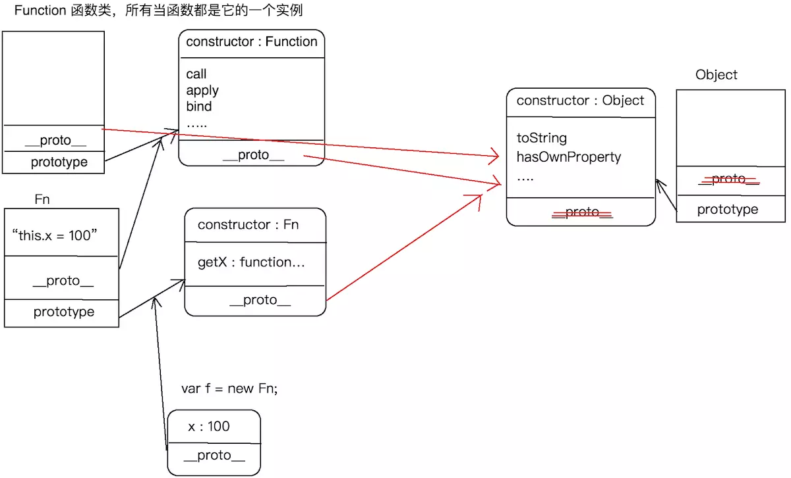

## JavaScript中的call、apply、bind深入理解
##### 来源：https://www.jianshu.com/p/00dc4ad9b83f，原作者：iceman_dev
### 函数的三种角色
```
首先要理解在函数本身会有一些自己的属性，比如
length：形参个数
name：函数名
prototype:类的原型，在原型上定义的方法都是当前这个类的实例的公有方法
__proto__：把函数当做一个普通对象，指向Function这个类的原型
函数在整个JavaScript中是最复杂也是最重要的知识，对于一个函数来说，会存在多重角色
function Fn () {
  var num = 500;
  this.x = 100;
}
Fn.prototype.getX = function () {
  console.log(this.x);
}
Fn.aaa = 1000;
var f = new Fn;
console.log(f.num);
console.log(f.aaa);
var  res=Fn();
角色1: 普通函数 ，对于Fn而言，它本身是一个普通的函数，执行的时候会形成私有的作用域，然后进行形参赋值，预解析，代码执行，执行完成后内存销毁
角色2: 类，它有自己的实例，f就是Fn作为了类的而产生的一个实例，也有一个叫做prototype的属性是自己的原型，它的实例都可以指向自己的原型
角色3:  普通对象，Fn和var obj={}的obj一样，就是一个普通的对象（所有的函数都是Function的实例），它作为对象可以有一些自己的私有属性，也可以通过__proto__找到Function.prototype；、
角色3图解
```

### call深入
#### call的基本作用：改变this的指向
```
var ary = [12, 23, 34];
ary.slice();
以上两行简单的代码的执行过程为：ary这个实例通过原型链的查找机制找到Array.prototype上的slice方法，让找到的slice方法执行，在执行slice方法的过程中才把ary数组进行了截取。

注意：slice方法执行之前有一个在原型上查找的过程（当前实例中没有找到，再根据原型链查找）。

当知道了一个对象调用方法会有一个查找过程之后，我们再看：

var obj = {name:'iceman'};
function fn() {
    console.log(this);
    console.log(this.name);
}
fn(); // this --> window
// obj.fn(); // Uncaught TypeError: obj.fn is not a function
fn.call(obj);
call方法的作用：首先寻找call方法，最后通过原型链在Function的原型中找到call方法，然后让call方法执行，在执行call方法的时候，让fn方法中的this变为第一个参数值obj，最后再把fn这个函数执行。
```
#### call方法原理
模拟Function中内置的call方法，写一个myCall方法，探讨call方法的执行原理