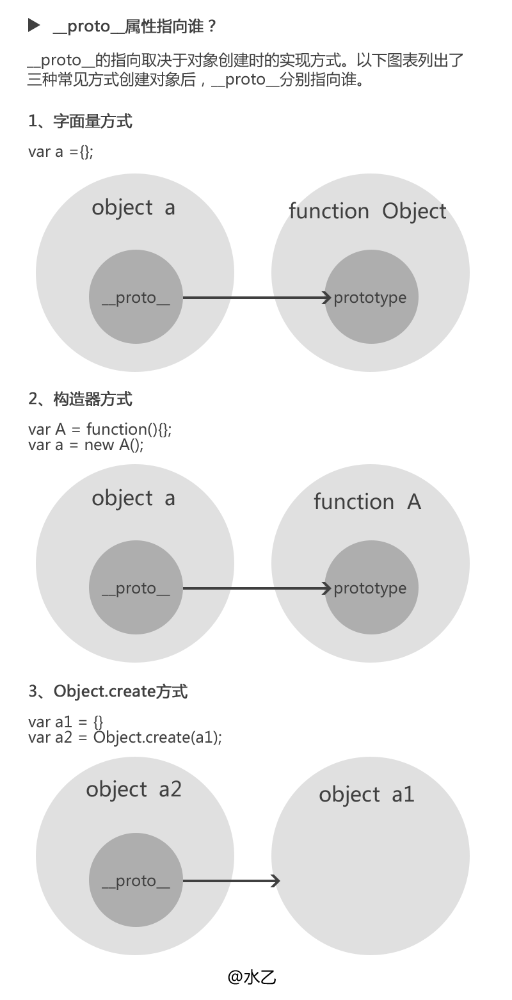

# 原型及原型链模块面试题
## 题目1
```
var A = function() {};
A.prototype.n = 1;
var b = new A();
A.prototype = {
  n: 2,
  m: 3
}
var c = new A();

console.log(b.n); // 1
console.log(b.m); // undefined

console.log(c.n); // 2
console.log(c.m); // 3
解析:
  var A = function() {};
  A.prototype.n = 1; // 此时将A原型放到一块内存空间里面（#1），给这个原型添加一个熟悉n，并赋值为1
  var b = new A(); 
// 通过new创建一个实例b，A是b的构造函数，b的__proto__ 指向A的prototype（此时的this指向是#1）
  A.prototype = {
    n: 2,
    m: 3
  } 
// 此时将A的原型对象更换了一个新的内存空间（#2），里面有属性n，m，所以c的__proto__指向的是A的protoType（#2）
  

```
## 题目2 
```
var F = function() {};

Object.prototype.a = function() {
  console.log('a');
};

Function.prototype.b = function() {
  console.log('b');
}

var f = new F();

f.a(); // a
f.b(); // b is not a function

F.a(); // a
F.b(); // b

```
## 题目3
```
function Person(name) {
    this.name = name
}
let p = new Person('Tom');

问题1：1. p.__proto__等于什么？ Person.prototype

问题2：Person.__proto__等于什么？Function.prototype
```
## 题目4 
```
var foo = {},
    F = function(){};
Object.prototype.a = 'value a';
Function.prototype.b = 'value b';

console.log(foo.a); // 'value a'
console.log(foo.b); // undefined

console.log(F.a);  // 'value a'
console.log(F.b); // 'value b'

```
## 题目5 &nbsp; prototype和__proto__的区别
```
解析：
  prototype是函数才有的属性
  __proto__是每个对象才有的属性，但是__proto__不是一个规范的属性，只是部分浏览器实现了此属性，对应的标准属性是[[prototype]] 
  备注：
    大多数情况下，__proto__可以理解为“构造函数的原型”，即：__proto__ = constructor.prototype
    (Object.create()创建的对象不适用于此等式)
```
## 题目6 &nbsp; __proto__指向的是谁

```
/*1、字面量方式*/
var a = {};
console.log(a.constructor); //function Object() { [native code] } (即构造器Object）
console.log(a.__proto__ === a.constructor.prototype); //true

/*2、构造器方式*/
var A = function (){}; var a = new A();
console.log(a.constructor); // function(){}（即构造器function A）
console.log(a.__proto__ === a.constructor.prototype); //true

/*3、Object.create()方式*/
var a1 = {a:1} 
var a2 = Object.create(a1);
console.log(a2.constructor); //function Object() { [native code] } (即构造器Object)
console.log(a2.__proto__ === a1);// true 
console.log(a2.__proto__ === a2.constructor.prototype); //false（此处即为图1中的例外情况）
```